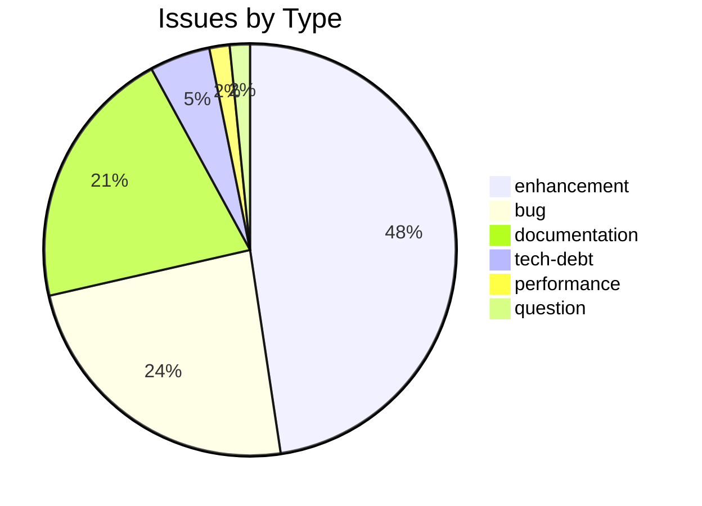
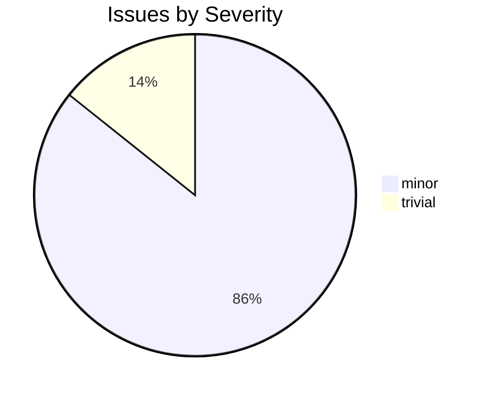

# csl-websanlexicon

CDSL **web-frontend** repository in the Sanskrit Lexicon project.

<!-- BEGIN MANUAL: overview -->
`csl-websanlexicon` contains web-display files, templates, and legacy display
material for the public Cologne Sanskrit Lexicon site.  It works with
`csl-orig` and `csl-pywork`: source text comes from `csl-orig`, generated
dictionary installations are assembled by `csl-pywork`, and this repository
supplies the web side of those installations.

## Runtime surfaces

| Path | Role |
|---|---|
| `v02/` | Current web-generation area used with the modern `csl-pywork/v02` pipeline. |
| `v00/` | Older web-generation system and historical work notes. |
| `inventories/` | Inventory/control files for generated web installations. |
| `issues/` | Issue-specific display fixes and experiments. |
| `webbackup/` | Historical per-dictionary web backups; useful evidence, not the first place for new work. |
| `readme_cologne.org`, `readme_xampp.org` | Installation notes for Cologne and XAMPP-style layouts. |

## Architecture map

The practical pipeline is:

```text
csl-orig source -> csl-pywork generation -> csl-websanlexicon templates/files -> generated dictionary web directory
```

Current work should start with `v02/` unless an issue explicitly concerns the
older `v00/` display.  Treat `webbackup/` as reference material: it can answer
"how did this dictionary display used to look?" but should not be edited as the
current source of truth without a specific reason.

## Local inspection / deploy notes

The old install notes assume sibling repositories and generated dictionary
directories:

```text
cologne/
  csl-orig/
  csl-pywork/
  csl-websanlexicon/
  mw/
  acc/
```

For generation commands, start in `csl-pywork/v02` and read
[`csl-pywork/v02/readme.md`](https://github.com/sanskrit-lexicon/csl-pywork/blob/master/v02/readme.md).
This repo supplies files that `generate_web.sh` copies/renders into the output.

## Relation to sibling repos

| Repo | Relation |
|---|---|
| `csl-orig` | Canonical dictionary source text. |
| `csl-pywork` | Builds dictionary output and calls web-generation steps. |
| `csl-apidev` | API and search/display backend experiments. |
| `csl-app` | Modern app surface that consumes dictionary data differently. |

## Known legacy zones

`v00/`, `webbackup/`, and many `readme.txt` files preserve historical display
work.  Keep them auditable.  If a cleanup moves or deletes a legacy file, record
why it is no longer needed by the current `v02` generation path.
<!-- END MANUAL: overview -->

## Issues Overview

**Total**: 61 | **Open**: 25 | **Closed**: 36

### By Milestone

| Milestone | Open | Closed | Total |
|---|---|---|---|
| Unassigned | 25 | 36 | 61 |

### By Type



### By Severity



## GitHub Issue Conventions

Follows the [Cologne tooling-repo taxonomy](https://github.com/sanskrit-lexicon/csl-observatory/blob/main/runbook/cologne-tooling-runbook.md):

- **9 type labels**: bug, feature, enhancement, performance, tech-debt, security, documentation, infrastructure, question
- **4 severity levels**: trivial, minor, major, critical
- **5 milestones**: API Stability, User Experience, Data Quality, Developer Experience, Community
- **Org Project**: [Tooling Roadmap](https://github.com/orgs/sanskrit-lexicon/projects/9)

See [CLAUDE.md](CLAUDE.md) for full definitions.

---
*Generated by Cologne Tooling Runbook on 2026-05-15*
